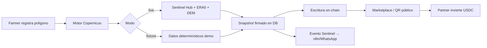

# 01 — Introducción

## Contexto del hackathon

**Harvverse Sentinel** es la versión del producto Harvverse desarrollada para el **Hackathon Copernicus**. El objetivo es demostrar que la inteligencia satelital no es solo un dashboard de monitoreo, sino una **condición de financiamiento** verificable para pequeños productores de café en América Latina.

El repositorio es un fork de Harvverse adaptado al reto: integra datos de **Sentinel-2** (óptico/NDVI), **Sentinel-1** (radar/SAR), **ERA5** (clima) y un **gate EUDR** (Reglamento de Deforestación de la UE) en un flujo completo desde el registro de un polígono GPS hasta la inversión on-chain.

---

## El problema

Los pequeños caficultores necesitan capital de trabajo estacional, pero el crédito disponible suele estar diseñado para maquinaria industrial, no para agricultura. Al mismo tiempo, el **EUDR** exige trazabilidad GPS y cumplimiento de uso de suelo para exportar café a Europa — un requisito existencial para muchos exportadores.

Harvverse Sentinel propone cerrar esa brecha: usar satélites para **calificar el riesgo del lote** y **desbloquear co-inversión** solo cuando el lote cumple criterios objetivos.

---

## La solución en tres capas

### Capa 1 — Motor de riesgo Copernicus

Cuando un agricultor registra un lote con un polígono GPS, el sistema calcula una puntuación **0–100** usando siete variables derivadas de Copernicus:

| # | Variable | Fuente | Peso |
|---|----------|--------|------|
| 1 | Salud del dosel (NDVI, NDRE, NDWI) | Sentinel-2 | 20% |
| 2 | Estabilidad NDVI a 2 años | Sentinel-2 | 10% |
| 3 | Humedad/estructura SAR | Sentinel-1 | 10% |
| 4 | Ajuste de lluvia anual | ERA5 | 15% |
| 5 | Riesgo térmico estacional | ERA5 | 10% |
| 6 | Gate EUDR post-diciembre 2020 | Sentinel-2 + JRC | 20% |
| 7 | Altitud, área y idoneidad del terreno | Polígono + DEM | 15% |

**Bandas de riesgo:**

| Puntuación | Tier | Significado |
|------------|------|-------------|
| 80–100 | Excelente | Condiciones óptimas |
| 60–79 | Bueno | Elegible para co-inversión |
| 40–59 | Moderado | Monitoreo recomendado |
| 20–39 | Alto riesgo | Bloqueado para inversión |
| 0–19 | No viable | Bloqueado |

**Regla EUDR absoluta:** si se detecta deforestación posterior a diciembre de 2020, el lote queda marcado como `EUDR NON-COMPLIANT` y se bloquea del marketplace **sin excepción**, independientemente de la puntuación numérica.

### Capa 2 — Puente Copernicus → Smart Contract

El motor produce un payload firmado off-chain. Un operador (o script de demo) escribe en la blockchain:

- `riskScore` (0–100)
- `eudrCompliant` (boolean)
- `scoreHash` (SHA-256 del snapshot)
- `scoreVersion` (versión del algoritmo)

**Reglas de elegibilidad on-chain** (`HarvverseLot.isInvestmentEligible`):

- Puntuación ≥ 60 **y** EUDR compliant → elegible para inversión
- Puntuación < 40 → bloqueado
- EUDR non-compliant → bloqueado sin excepción

### Capa 3 — Directorio abierto de fincas

Cualquier agricultor puede registrar su finca, recibir una puntuación satelital verificada y ser descubierto por compradores e inversores. Cada perfil público expone:

- Polígono GPS en mapa satelital
- Puntuación 0–100 con desglose de las siete variables
- Estado EUDR (Verified / Non-Compliant)
- Disponibilidad para co-inversión
- URL pública amigable para QR (`/lot/[code]`)
- Hash y metadatos de prueba blockchain

---

## YieldPredict

Además del score de riesgo, el sistema estima la **cosecha proyectada en quintales (qq)** usando:

```
proyección = área_mz × rendimiento_base(variedad+altitud) × modificador_NDVI × modificador_densidad
```

Esto convierte la señal satelital en un argumento concreto de inversión para partners.

---

## Roles de usuario

| Rol | Descripción |
|-----|-------------|
| **Farmer** (agricultor) | Registra fincas y lotes, solicita scoring, publica en el directorio |
| **Partner** (inversor) | Explora lotes, revisa scores, propone co-inversión vía USDC |
| **Admin / Operator** | Gestiona contratos, attestation de evidencia, settlement |
| **Verifier / Auditor** | Roles de cumplimiento y revisión (demo) |

---

## Momentos clave de la demo

El flujo que deben recordar los evaluadores:

1. **Vista satelital real** del lote: polígono, NDVI Sentinel-2, estado de salud verde
2. **YieldPredict → inversión**: quintales proyectados convertidos en argumento de partner
3. **WhatsApp en vivo**: evento Sentinel enviado a n8n/WhatsApp desde el estado del lote
4. **QR → prueba blockchain**: página pública con agricultor, NDVI, EUDR y hash Base L2
5. **Token de carbono/impacto** (opcional si hay tiempo)

---

## Loop completo del sistema



---

## Glosario

| Término | Definición |
|---------|------------|
| **Lote (lot)** | Unidad de inversión: parcela de café con polígono, plan agronómico y score |
| **Finca (farm)** | Propiedad del agricultor; puede contener varios lotes |
| **Snapshot Copernicus** | Registro inmutable del cálculo de score en un momento dado |
| **EUDR** | EU Deforestation Regulation — exige demostrar que el café no proviene de tierras deforestadas después de 2020 |
| **NDVI** | Normalized Difference Vegetation Index — índice de vigor vegetal (0–1) |
| **Manzana (mz)** | Unidad de área usada en Centroamérica (~0.7 hectáreas) |
| **Quintal (qq)** | ~100 lb de café pergamino |
| **Fixture** | Modo demo con datos determinísticos, misma forma que live |
| **Score hash** | SHA-256 del payload de evidencia; prueba de integridad |
