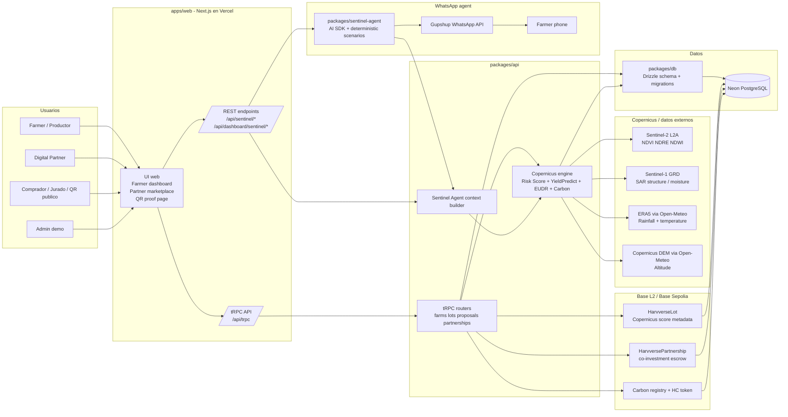
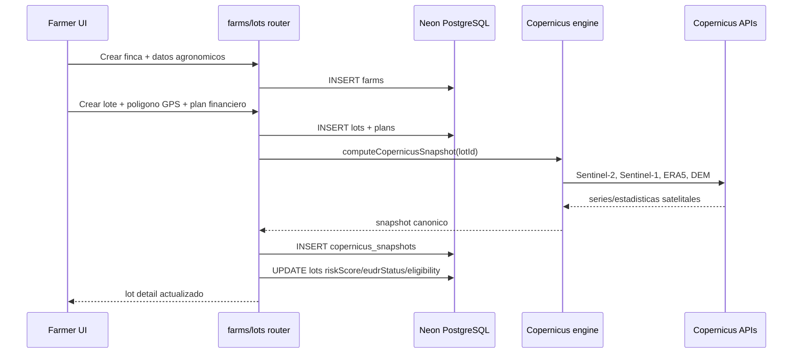
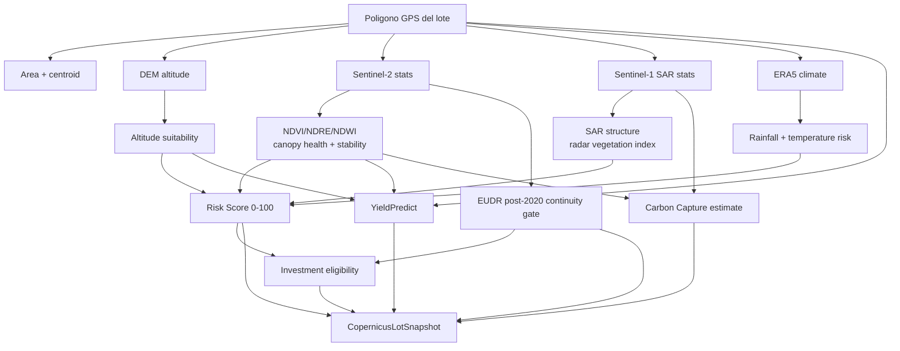
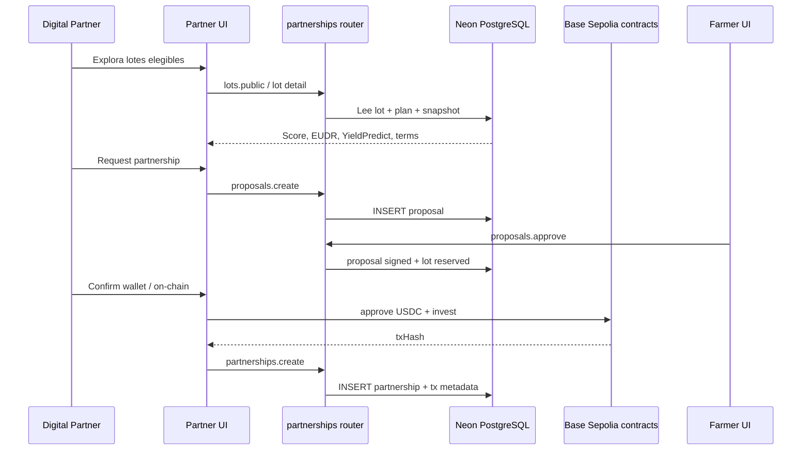
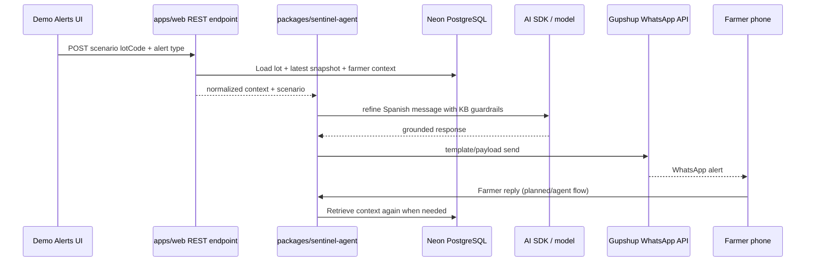
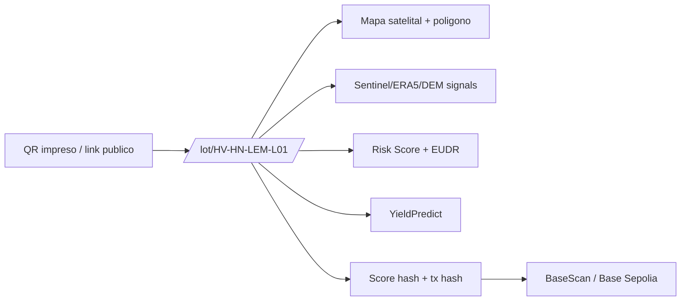
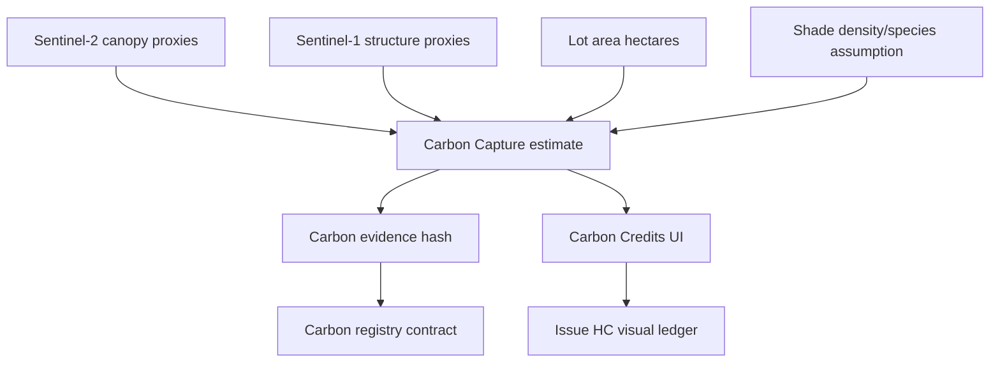
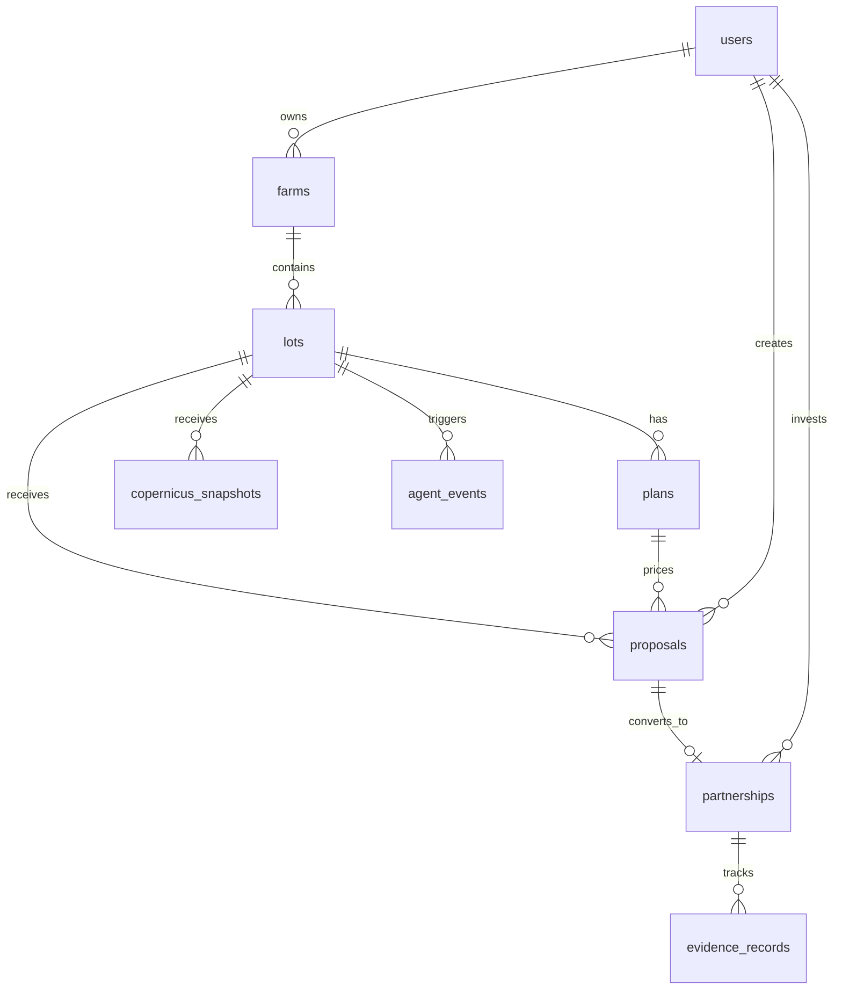

# 02 — Arquitectura Harvverse Sentinel

## Resumen ejecutivo

Harvverse Sentinel conecta tres mundos que normalmente viven separados:

1. **Productor y finca**: registro de finca/lote, polígono GPS, agronomía básica y términos de co-inversión.
2. **Copernicus**: Sentinel-2, Sentinel-1 SAR, ERA5 y DEM para generar score de riesgo, YieldPredict, EUDR gate y estimación de carbono.
3. **Finanzas verificables**: contratos en Base L2/Base Sepolia, prueba on-chain del score, partnership/escrow y registro de carbono.

La demo actual corre como una aplicación Next.js desplegada en Vercel, con PostgreSQL en Neon, autenticación Clerk, alertas WhatsApp por Gupshup/AI SDK y contratos Solidity desplegados para la demo en Base Sepolia.

---

## Diagrama de arquitectura general

---

## Capas principales

| Capa | Ubicación | Responsabilidad |
|---|---|---|
| Web app | `apps/web` | UI farmer, partner, QR proof, admin demo alerts, API routes Next.js |
| API negocio | `packages/api` | Routers tRPC, permisos, Copernicus engine, partnerships, proof writers |
| Base de datos | `packages/db` | Esquema Drizzle, migraciones, seed/demo data, acceso PostgreSQL |
| Contratos | `packages/contracts` | Solidity, Hardhat, Base Sepolia deploy, setup demo, proof scripts |
| Agent/WhatsApp | `packages/sentinel-agent` | Contexto para AI SDK, escenarios, Gupshup payloads, respuestas WhatsApp |
| Worker alertas | `apps/whatsapp-worker` | Cron/dry-run para preparar alertas desde snapshots recientes |
| UI shared | `packages/ui` | Componentes reutilizables sin lógica de dominio |
| Env | `packages/env` | Validación Zod de variables de entorno |

---

## Flujo 1 — Registro de finca y lote

Resultado en UI:

- Mapa del lote con polígono.
- Score Copernicus 0-100.
- EUDR Verified / blocked.
- YieldPredict actual y potencial maduro.
- Estimación de ganancia farmer/partner.
- Carbon Capture y evidencia on-chain.

---

## Flujo 2 — Motor Copernicus

Variables usadas para el score:

1. Salud optica de dosel Sentinel-2.
2. Estabilidad Sentinel-2 de dos anos.
3. Estructura/humedad Sentinel-1 SAR.
4. Ajuste de lluvia anual ERA5.
5. Riesgo de temperatura estacional ERA5.
6. Gate EUDR de cobertura post-2020.
7. Idoneidad de altitud y area del poligono.

---

## Flujo 3 — Co-inversion y proof on-chain

Reglas de elegibilidad:

- `riskScore >= 60` para marketplace-ready.
- `riskScore < 40` bloquea inversion.
- `EUDR non_compliant` bloquea siempre, aunque el score numerico sea alto.
- El proof on-chain guarda hashes/metadata para que el score sea verificable.

---

## Flujo 4 — Alertas WhatsApp / Sentinel Agent

Escenarios preparados:

- Lote aprobado por Copernicus.
- EUDR bloqueado.
- Estrés hidrico.
- Riesgo fungico / roya.
- NDVI -> dinero.
- Explicacion educativa de roya.
- Floracion positiva.

Para la demo, el momento principal es **NDVI -> dinero**: el satelite detecta una caida de vigor y el mensaje explica impacto agronomico y financiero en lenguaje simple.

---

## Flujo 5 — QR proof publico

La pagina publica permite que un comprador, partner o juez vea la historia verificable del lote sin entrar al dashboard privado.

---

## Flujo 6 — Carbon Capture y HC

Importante:

- El valor actual es un **screening estimate**, no un credito certificado listo para venta.
- Para version productiva se requiere inventario de campo, especies de sombra, ecuaciones alometricas y verificacion MRV.
- En la demo, HC muestra como el productor puede tener un tercer activo: cosecha, co-inversion y carbono.

---

## Modelo de datos de alto nivel

Tablas clave:

- `users`: farmer, partner, admin.
- `farms`: finca, ubicacion, productor, metadata agronomica.
- `lots`: lote, poligono, area, edad de plantas, variedad, score denormalizado.
- `plans`: ticket, precio, costo agronomico, split farmer/partner.
- `copernicus_snapshots`: snapshot canonico satelital y proof metadata.
- `proposals`: solicitud de partnership.
- `partnerships`: alianza activa con tx/wallet metadata.
- `agent_events`: trazabilidad de alertas/agente.

---

## Ambientes

| Ambiente | Hosting | DB | Chain | Uso |
|---|---|---|---|---|
| Local | Next dev server | PostgreSQL local / Docker | Hardhat local | Desarrollo |
| Demo hackathon | Vercel | Neon | Base Sepolia | Video, jueces, smoke test publico |
| Produccion futura | Vercel/infra dedicada | Postgres gestionado | Base L2 mainnet | Clientes reales |

---

## Dependencias externas actuales

| Servicio | Uso |
|---|---|
| Clerk | Autenticacion y sesiones farmer/partner |
| Neon | PostgreSQL demo desplegado |
| Vercel | Hosting Next.js y route handlers |
| Sentinel Hub / CDSE | Sentinel-2 y Sentinel-1 statistics |
| Open-Meteo | ERA5 y Copernicus DEM endpoint |
| Base Sepolia | Contratos y proof on-chain para demo |
| Gupshup | Envio WhatsApp |
| AI SDK / modelo | Redaccion/grounding del agente WhatsApp |

---

## Decisiones tecnicas importantes

- El **lote** es la unidad financiera: score, YieldPredict, EUDR, carbon y proof se calculan por lote.
- El snapshot Copernicus es un contrato de datos unico para UI, agente, QR proof y chain bridge.
- El score y EUDR se denormalizan en `lots` para listados rapidos, pero el detalle vive en `copernicus_snapshots`.
- Base Sepolia se usa para la demo; el mismo patron aplica a Base mainnet si se decide pasar a produccion.
- WhatsApp ya no depende de n8n como ruta principal; el agente vive en `packages/sentinel-agent` y usa endpoints estables.
- Carbono se muestra como POC verificable, no como credito certificado final.

---

## Pendientes de arquitectura productiva

- MRV formal para carbono: inventario de sombra, especies, alometricas, auditor/verificador.
- EUDR legal-grade: interseccion oficial JRC baseline + evidencia forest-loss validada.
- Observabilidad: logs estructurados, retries, auditoria de alertas y tracing de jobs.
- Jobs programados: worker/cron para monitoreo continuo sin boton manual.
- Custodia/escrow productivo: contrato final, banco/seguro, compliance y terminos legales.
- Separacion formal de staging/production y rotacion de secretos.