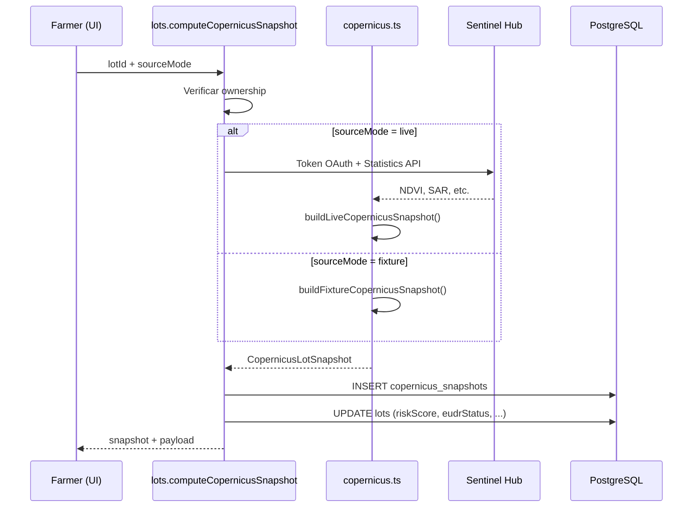
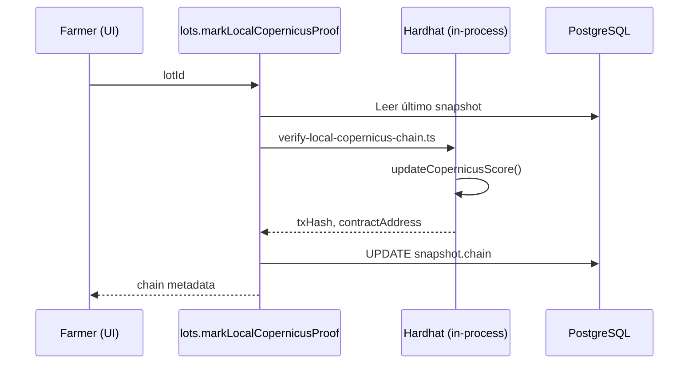

# 02 — Arquitectura

## Visión general

Harvverse Sentinel es un **monorepo Turborepo** con separación clara de responsabilidades. La aplicación web (`apps/web`) consume la API tRPC (`packages/api`), que a su vez persiste en PostgreSQL vía Drizzle (`packages/db`). Los contratos Solidity viven en `packages/contracts` y se despliegan localmente con Hardhat o en Base L2 para producción.

```
┌─────────────────────────────────────────────────────────────────┐
│                        apps/web (Next.js)                       │
│  Páginas · Layouts · Componentes · Route handlers · i18n        │
└────────────────────────────┬────────────────────────────────────┘
                             │ tRPC (/api/trpc)
                             │ REST (/api/sentinel/alerts)
┌────────────────────────────▼────────────────────────────────────┐
│                      packages/api (tRPC)                        │
│  Routers · Validación Zod · Lógica Copernicus · Auth context   │
└──────┬─────────────────────────────┬────────────────────────────┘
       │                             │
       ▼                             ▼
┌──────────────┐              ┌──────────────────┐
│ packages/db  │              │ Copernicus APIs  │
│ PostgreSQL   │              │ Sentinel Hub     │
│ Drizzle ORM  │              │ Open-Meteo ERA5  │
└──────────────┘              │ Open-Meteo DEM   │
                              └──────────────────┘
       │
       ▼
┌──────────────────────────────────┐
│     packages/contracts (Hardhat) │
│  HarvverseLot · Partnership ·    │
│  Evidence · MockUSDC             │
└──────────────────────────────────┘
```

---

## Estructura del repositorio

```
harvverse-copernicus-hackathon/
├── apps/
│   └── web/                    # Aplicación Next.js (puerto 3001)
│       ├── src/app/            # App Router: rutas, layouts, API routes
│       ├── src/components/     # Componentes específicos de la app
│       ├── src/hooks/          # Hooks React (wallet, partnerships)
│       ├── src/lib/            # Utilidades (geo, chainProof)
│       └── messages/           # i18n (es.json, en.json)
├── packages/
│   ├── api/                    # Servidor tRPC y lógica de negocio
│   │   └── src/
│   │       ├── routers/        # Un router por dominio
│   │       └── lib/copernicus/ # Integraciones satelitales
│   ├── db/                     # Esquema Drizzle, migraciones, seed
│   ├── contracts/              # Contratos Solidity + scripts Hardhat
│   ├── env/                    # Validación de variables de entorno (Zod)
│   ├── ui/                     # Componentes shadcn compartidos
│   └── config/                 # tsconfig base compartido
├── docs/                       # Documentación del proyecto (este directorio)
├── scripts/                    # Scripts de verificación live Copernicus
├── fixtures/                   # Payloads JSON para pruebas del agente / eventos Sentinel
└── .docs/sentinel/             # Material interno del hackathon
```

---

## Reglas de propiedad del código

| Qué va dónde | Ejemplos |
|--------------|----------|
| `apps/web` | Rutas, páginas, layouts, componentes de producto, route handlers |
| `packages/ui` | Botones, cards, dialogs — primitivos reutilizables sin lógica de negocio |
| `packages/api` | Procedimientos tRPC, validación, scoring Copernicus, permisos |
| `packages/db` | Tablas, relaciones, migraciones SQL, cliente Drizzle |
| `packages/env` | Esquemas Zod para variables de entorno |
| `packages/contracts` | Solidity, tests, deploy scripts |

**Principio:** el comportamiento de producto vive cerca del paquete que lo posee. No importar internals de un paquete desde otro sin pasar por su API pública (`exports` en `package.json`).

---

## Flujo de datos: scoring Copernicus



Al crear un lote con polígono, el scoring se dispara **automáticamente en background** (live si hay credenciales Sentinel Hub, fixture si no).

---

## Flujo de datos: prueba on-chain local



---

## Autenticación

- **Clerk** maneja sign-in/sign-up en `/sign-in` y `/sign-up`
- El middleware de Next.js extrae `clerkId` y lo pasa al contexto tRPC
- `protectedProcedure` exige `clerkId` presente; `publicProcedure` no
- Onboarding en `/onboarding`: el usuario elige rol (Farmer o Partner) y se crea el registro en `users`
- Soporte opcional de wallet Web3 vía Clerk + wagmi/viem en el frontend

---

## Internacionalización

La app usa **next-intl** con mensajes en `apps/web/messages/es.json` y `en.json`. La locale por defecto es español (`es`), coherente con el mercado LATAM.

---

## Modos de operación Copernicus

El sistema soporta dos modos con **el mismo contrato de datos**:

| Modo | Cuándo se usa | Credenciales |
|------|---------------|--------------|
| `fixture` | Demo sin internet satelital, CI, desarrollo rápido | Ninguna |
| `live` | Demo con datos reales, producción | `SENTINEL_HUB_CLIENT_ID` + `SENTINEL_HUB_CLIENT_SECRET` |

La UI, la base de datos y los contratos **no distinguen** el origen del snapshot; solo leen `sourceMode` como metadato informativo.

---

## Paquetes y dependencias internas

```
web → api, db, env, ui, contracts
api → db, env
db  → (standalone, usado por api y scripts)
contracts → (standalone, invocado por api y scripts)
env → (standalone, validación Zod)
ui  → (standalone, primitivos React)
```

Turborepo orquesta `dev`, `build`, `check-types` y tareas de base de datos con cacheo inteligente (excepto tareas `db:*` que son `cache: false`).
