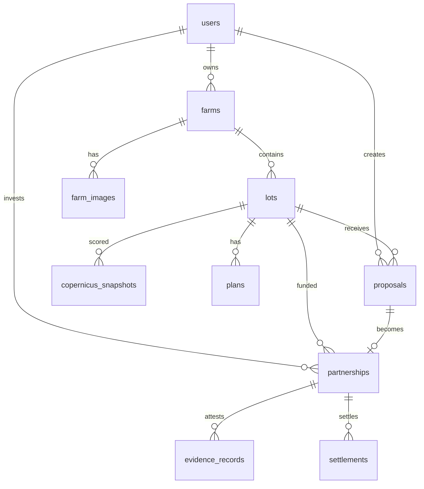

# 06 — Base de datos

Harvverse Sentinel usa **PostgreSQL** con **Drizzle ORM**. El esquema completo está en `packages/db/src/schema/index.ts`.

---

## Configuración

| Archivo | Propósito |
|---------|-----------|
| `packages/db/drizzle.config.ts` | Configuración Drizzle Kit |
| `packages/db/docker-compose.yml` | Postgres local (puerto 5432) |
| `packages/db/src/index.ts` | Cliente Drizzle exportado |
| `packages/db/src/migrations/` | Migraciones SQL versionadas |

`DATABASE_URL` se lee desde `apps/web/.env` (o `DOTENV_PATH` si se define).

---

## Diagrama de entidades principales



---

## Tablas por dominio

### Usuarios y autenticación

#### `users`

| Columna | Tipo | Descripción |
|---------|------|-------------|
| `id` | serial | PK |
| `clerkId` | text | ID de Clerk (único) |
| `email` | text | Email |
| `displayName` | text | Nombre visible |
| `role` | enum | `farmer`, `partner`, `admin`, etc. |
| `walletAddress` | text | Dirección Ethereum (única) |
| `phone` | text | Teléfono (WhatsApp) |
| `country` | text | País |
| `status` | enum | `active` / `disabled` |

#### `wallet_sessions`

Sesiones de firma wallet para autenticación Web3 (nonce, chainId, expiración).

---

### Fincas y lotes

#### `farms`

Propiedad del agricultor con metadatos geográficos.

| Columna destacada | Descripción |
|-------------------|-------------|
| `polygon` | GeoJSON del perímetro de la finca |
| `altitudeMasl` | Altitud en metros sobre el nivel del mar |
| `areaManzanas` | Área total |
| `varieties` | Array de variedades de café |
| `verified` | Badge de verificación |

#### `farm_images`

Imágenes de finca (base64 en DB o storage externo futuro).

#### `lots`

Unidad central de inversión y scoring.

| Columna destacada | Descripción |
|-------------------|-------------|
| `code` | Código único público (para QR) |
| `polygon` | GeoJSON del lote — **requerido para scoring** |
| `status` | `draft`, `available`, `reserved`, `active`, `settled`, `coming_soon` |
| `riskScore` | 0–100 (resumen del último snapshot) |
| `riskTier` | `excellent`, `good`, `moderate`, `high_risk`, `not_viable` |
| `eudrStatus` | `verified`, `non_compliant`, `unknown` |
| `scoreHash` | SHA-256 del último snapshot |
| `scoreVersion` | Versión del algoritmo |
| `copernicusSnapshotId` | FK al snapshot más reciente |
| `onchainLotId` | ID del lote en contrato Solidity |

---

### Copernicus ⭐

#### `copernicus_snapshots`

Histórico completo de cada cálculo de score.

| Columna | Tipo | Descripción |
|---------|------|-------------|
| `sourceMode` | enum | `fixture` / `live` |
| `scoreVersion` | varchar | Versión del algoritmo |
| `riskScore` | integer | 0–100 |
| `riskTier` | enum | Banda de riesgo |
| `eudrStatus` | enum | Estado EUDR |
| `eligibleForInvestment` | boolean | Elegible marketplace |
| `variables` | jsonb | Array de 7 variables con score/weight |
| `sources` | jsonb | Metadatos de proveedores de datos |
| `dataQuality` | jsonb | Confianza, warnings, parcel scale |
| `sentinel2` | jsonb | NDVI series, índices actuales |
| `sentinel1` | jsonb | VV, VH, RVI, moisture proxy |
| `dem` | jsonb | Altitud, área, idoneidad |
| `era5` | jsonb | Lluvia, temperatura, estrés |
| `eudr` | jsonb | Gate completo con reasons/limitations |
| `yield_predict` | jsonb | Proyección de quintales |
| `chain` | jsonb | txHash, contractAddress, metadataStatus |
| `signedPayload` | jsonb | Payload + signature + signer |
| `scoreHash` | varchar(64) | Hash de integridad |

Cada recálculo inserta una **nueva fila**; nunca se sobrescribe el histórico.

---

### Inversión y contratos

#### `plans`

Plan agronómico-financiero vinculado a un lote.

| Columna destacada | Descripción |
|-------------------|-------------|
| `ticketCents` | Monto de inversión del partner (centavos USD) |
| `priceCentsPerLb` | Precio fijo por libra |
| `projectedYieldY1TenthsQq` | Rendimiento proyectado (décimas de quintal) |
| `splitFarmerBps` / `splitPartnerBps` | Reparto de utilidades (basis points) |
| `planHash` | SHA-256 de términos |

#### `agronomic_plans`

Plan agronómico detallado con milestones y actividades (JSONB).

#### `proposals`

Propuesta de un partner para invertir en un lote.

#### `partnerships`

Partnership activo post-firma. Vincula proposal → lot → plan.

#### `evidence_records`

Evidencia de milestones (fotos, sensores, cosecha) con hash y attestation.

#### `settlements`

Liquidación de cosecha con cálculo de revenue/profit/farmer/partner en centavos.

---

### Blockchain

#### `chain_transactions`

Registro de transacciones on-chain (deploy, approval, partnership, settlement).

#### `contract_deployments`

Direcciones de contratos desplegados por chain (`hardhat`, `baseSepolia`).

#### `custody_accounts`

Cuentas custodia para escrow demo.

---

### Comunicación e IA

#### `conversations` / `chat_messages`

Historial de conversaciones con agente IA (por `lotCode`).

#### `agent_events`

Eventos del agente vinculados a propuestas (`explanation_start`, `whatif_complete`, etc.).

---

### Otros

#### `waitlist_entries`

Registros de la landing page (email, país, rango de inversión).

#### `modules` / `sensor_data`

Datos IoT de sensores de campo (temperatura, humedad suelo) por semana.

---

## Enums importantes

```typescript
// Roles
userRoleEnum: farmer | partner | verifier | admin | settlement_operator | custodian | deployer | auditor

// Estado del lote
lotStatusEnum: draft | available | reserved | active | settled | coming_soon

// Copernicus
riskTierEnum: excellent | good | moderate | high_risk | not_viable
eudrStatusEnum: verified | non_compliant | unknown
copernicusSourceModeEnum: fixture | live

// Blockchain
chainKeyEnum: hardhat | baseSepolia
```

---

## Migraciones

Las migraciones SQL están en `packages/db/src/migrations/`:

| Archivo | Contenido aproximado |
|---------|---------------------|
| `0000_*.sql` | Esquema base Harvverse |
| `0001_*.sql` | Tablas Sentinel/Copernicus |
| `0002_*.sql` | Extensiones posteriores |

Para aplicar:

```bash
pnpm db:migrate
```

Para desarrollo rápido sin migración:

```bash
pnpm db:push
```

---

## Tipos TypeScript

Drizzle-Zod genera schemas de insert/select para cada tabla. Ejemplo:

```typescript
import type { Lot, CopernicusSnapshot } from "@harvverse-copernicus-hackathon/db/schema";
```

Los tipos se infieren automáticamente de las definiciones de tabla.

---

## Seed

```bash
pnpm db:seed
```

Ejecuta `packages/db/src/seed.ts` — datos demo opcionales. El script `setup:demo` de contratos también siembra finca/lote/plan.
