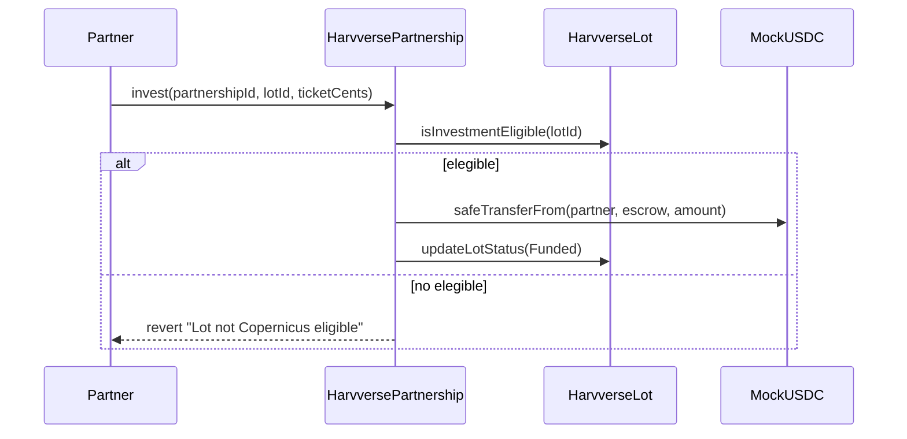

# 07 — Contratos inteligentes

Los contratos Solidity viven en `packages/contracts/`. Están escritos para **Solidity 0.8.24** con OpenZeppelin (AccessControl, ReentrancyGuard, SafeERC20).

En demo local se usa **Hardhat** (chain ID 31337). En producción el target es **Base L2** (Sepolia para testnet).

---

## Contratos desplegados

| Contrato | Archivo | Propósito |
|----------|---------|-----------|
| `HarvverseLot` | `HarvverseLot.sol` | Registro de lotes + metadata Copernicus |
| `HarvversePartnership` | `HarvversePartnership.sol` | Escrow USDC e inversión |
| `HarvverseEvidence` | `HarvverseEvidence.sol` | Attestation de evidencia agronómica |
| `MockUSDC` | `MockUSDC.sol` | USDC simulado para demo local |

---

## HarvverseLot

Gestiona el ciclo de vida del lote y almacena el score Copernicus on-chain.

### Estructuras

```solidity
struct LotRecord {
    bytes32 lotId;
    address farmer;
    uint32 targetYieldTenthsQq;  // rendimiento objetivo (décimas de qq)
    uint32 priceCentsPerLb;
    uint32 ticketCents;
    uint32 farmerShareBps;       // reparto farmer en basis points
    LotStatus status;
    uint64 createdAt;
}

struct CopernicusScore {
    uint8 riskScore;             // 0–100
    bool eudrCompliant;
    bytes32 scoreHash;           // SHA-256 del snapshot
    string scoreVersion;
    uint64 updatedAt;
}
```

### Estados del lote

```
Created → Funded → Active → Harvested → Settled
                                      ↘ Cancelled
```

### Funciones clave

| Función | Rol | Descripción |
|---------|-----|-------------|
| `createLot(...)` | OPERATOR | Registra un nuevo lote |
| `updateLotStatus(lotId, status)` | OPERATOR | Cambia estado |
| `updateCopernicusScore(...)` | OPERATOR | Escribe score satelital |
| `isInvestmentEligible(lotId)` | view | Verifica elegibilidad |
| `getLot(lotId)` | view | Lee registro del lote |
| `getCopernicusScore(lotId)` | view | Lee score Copernicus |

### Reglas de elegibilidad

```solidity
function isInvestmentEligible(bytes32 lotId) public view returns (bool) {
    CopernicusScore memory score = copernicusScores[lotId];
    return lots[lotId].createdAt != 0
        && score.updatedAt != 0
        && score.riskScore >= 60
        && score.eudrCompliant;
}
```

**Importante:**

- Score debe existir on-chain (`updatedAt != 0`)
- Score ≥ 60 **y** EUDR compliant
- El brief del hackathon menciona bloqueo duro en < 40; el contrato usa ≥ 60 como umbral de elegibilidad positiva

### Eventos

```solidity
event CopernicusScoreUpdated(
    bytes32 indexed lotId,
    uint8 riskScore,
    bool eudrCompliant,
    bytes32 scoreHash,
    string scoreVersion
);
```

---

## HarvversePartnership

Escrow de USDC para co-inversión. El partner deposita su ticket; al settlement se reparte según yield real.

### Conversión monetaria

```
1 centavo USD = 10,000 unidades USDC (6 decimales)
```

Constante: `CENTS_TO_USDC = 10_000`

### Flujo de inversión



### Settlement

El operador llama `recordSettlement(partnershipId, actualYield, agronomicCost)`:

```
revenueCents = actualYieldTenthsQq × 833 × priceCentsPerLb / 100
profitCents = revenueCents - ticketCents
partnerReturn = ticketCents - agronomicCost + (profit × partnerShareBps / 10000)
```

Si el payout excede el escrow, el operador deposita el delta (simula flujo de venta de café off-chain).

### Refund

`refund(partnershipId)` — devolución completa si el lote se cancela.

---

## HarvverseEvidence

Registro on-chain de evidencia agronómica (hashes de fotos, sensores, cosecha). Usado para attestation de milestones en el flujo demo.

---

## MockUSDC

ERC-20 con 6 decimales que simula USDC. En demo local, la cuenta Hardhat #0 recibe 10,000 ETH y USDC mock pre-fundeado.

---

## Roles y permisos

Todos los contratos usan **AccessControl** de OpenZeppelin:

| Rol | Permisos |
|-----|----------|
| `DEFAULT_ADMIN_ROLE` | Administra roles |
| `OPERATOR_ROLE` | createLot, updateScore, recordSettlement, refund |

En demo, el deployer recibe ambos roles.

---

## Scripts de deploy

| Script | Comando | Descripción |
|--------|---------|-------------|
| `deploy.ts` | `pnpm deploy:local` | Deploy básico a Hardhat |
| `setup-demo.ts` | `pnpm setup:demo` | Deploy + seed DB + escribe `.env` |
| `verify-local-copernicus-chain.ts` | `verify:copernicus-local-chain` | Escribe score on-chain desde snapshot |
| `write-copernicus-score.ts` | `write:copernicus-score` | Escritura manual de score |

Ejecutar desde `packages/contracts/` o con filter:

```bash
pnpm --filter @harvverse-copernicus-hackathon/contracts setup:demo
```

---

## Integración app ↔ contratos

### Frontend (wagmi/viem)

- `apps/web` lee direcciones de contrato desde `.env`:
  - `NEXT_PUBLIC_USDC_ADDRESS`
  - `NEXT_PUBLIC_PARTNERSHIP_ADDRESS`
  - `NEXT_PUBLIC_USE_LOCAL_CONTRACTS=true`
  - `NEXT_PUBLIC_HARDHAT_CHAIN_ID=31337`

- ABI exportado en `apps/web/public/contracts/hardhat.json`

### Backend (tRPC)

- `lots.markLocalCopernicusProof` invoca Hardhat in-process vía `execFile`
- Pasa snapshot JSON al script `verify-local-copernicus-chain.ts`
- Actualiza `copernicus_snapshots.chain` con `transactionHash` y `metadataStatus: "written"`

### Utilidades frontend

- `apps/web/src/lib/chainProof.ts` — helpers para labels de chain, lectura de proof metadata

---

## Tests

```bash
pnpm --filter @harvverse-copernicus-hackathon/contracts test
```

Tests en `packages/contracts/test/Harvverse.test.ts` cubren:

- Creación de lotes
- Escritura de score Copernicus
- Elegibilidad de inversión
- Flujo invest → settlement → refund

---

## Base L2 (producción)

Para testnet/producción en Base:

| Parámetro | Valor |
|-----------|-------|
| Chain key | `baseSepolia` |
| Tabla DB | `contract_deployments` registra direcciones activas |
| Tabla DB | `chain_transactions` registra tx hashes |

El flujo de demo local con Hardhat in-memory es equivalente funcionalmente; solo cambia la red y el mecanismo de firma de transacciones.

---

## Seguridad (consideraciones demo)

Esta implementación es para **hackathon/demo**:

- Firma off-chain del snapshot usa hash simétrico, no ECDSA real
- OPERATOR_ROLE centralizado (no multisig)
- MockUSDC sin valor real
- EUDR gate preliminar, no certificación legal

Para producción se requeriría: firma asimétrica con HSM, timelock en score updates, auditoría de contratos, y certificación EUDR con baseline JRC oficial.
