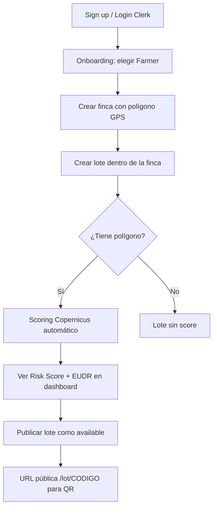
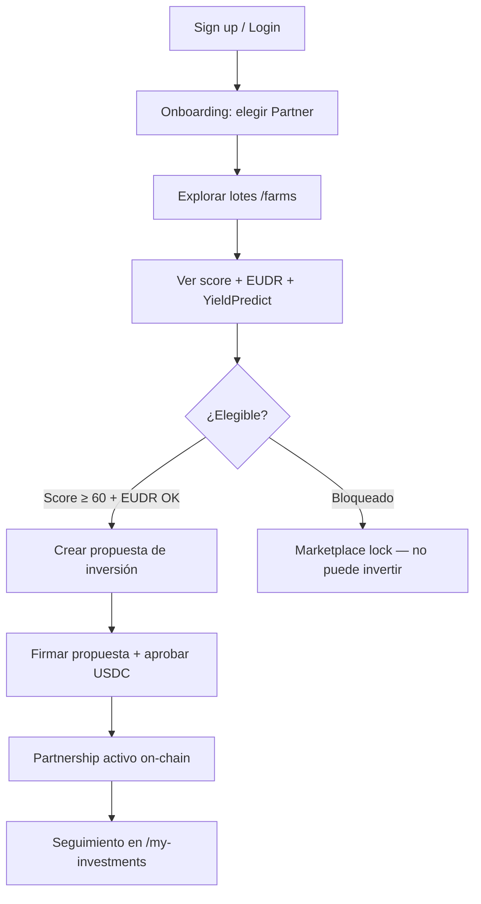

# 08 — Flujos de usuario

Esta guía describe los recorridos principales desde la perspectiva de cada actor. No requiere conocimiento técnico para entender el valor del producto.

---

## Actores

| Actor | Objetivo |
|-------|----------|
| **Agricultor (Farmer)** | Registrar su finca/lote, obtener score satelital, atraer inversión |
| **Partner (Inversor)** | Descubrir lotes verificados, evaluar riesgo, co-invertir |
| **Evaluador / Juez** | Ver demo del loop satélite → score → blockchain → inversión |
| **Equipo WhatsApp/IA** | Eventos Sentinel para n8n/WhatsApp; agente AI SDK como ruta futura |

---

## Flujo 1: Agricultor registra un lote



### Pasos detallados

1. **Registro:** `/sign-up` → verificación Clerk → `/onboarding` → rol Farmer
2. **Crear finca:** `/dashboard/farmer/create-farm` — nombre, país, región, polígono (mapa o KML)
3. **Crear lote:** `/dashboard/farmer/farms/[farmId]/create-lot` — variedad, área, árboles, polígono del lote
4. **Scoring automático:** al guardar con polígono, el backend calcula snapshot (live o fixture)
5. **Revisar score:** `/dashboard/farmer/lots/[lotId]` — NDVI, variables, YieldPredict
6. **Prueba blockchain (demo):** botón para escribir score en Hardhat local
7. **Publicar:** cambiar status a `available` → visible en `/farms` y `/lot/[code]`

### Rutas del agricultor

| Ruta | Función |
|------|---------|
| `/dashboard/farmer` | Panel principal |
| `/dashboard/farmer/my-farms` | Lista de fincas |
| `/dashboard/farmer/farms/[farmId]` | Detalle de finca |
| `/dashboard/farmer/lots/[lotId]` | Detalle de lote + Copernicus |
| `/dashboard/farmer/proposals` | Propuestas recibidas de partners |

---

## Flujo 2: Partner explora e invierte



### Pasos detallados

1. **Registro:** rol Partner en onboarding
2. **Explorar:** `/dashboard/player/explore` o `/farms` — filtrar por país/región
3. **Evaluar lote:** ver desglose de 7 variables, mapa NDVI, proyección de quintales
4. **Verificar elegibilidad:** badge verde si score ≥ 60 y EUDR Verified; rojo si bloqueado
5. **Proponer:** crear propuesta con ticket, mensaje, wallet conectada
6. **Invertir on-chain:** aprobar USDC mock → `invest()` en contrato Partnership
7. **Seguimiento:** `/my-investments` — milestones, evidencia, settlement

### Rutas del partner

| Ruta | Función |
|------|---------|
| `/dashboard/player` | Panel partner |
| `/dashboard/player/explore` | Marketplace de lotes |
| `/lots/[lotId]` | Detalle de lote (autenticado) |
| `/my-proposals` | Propuestas enviadas |
| `/my-investments` | Partnerships activos |
| `/investments/[id]` | Detalle de inversión |

---

## Flujo 3: Página pública QR (sin login)

La ruta `/lot/[code]` es la **cara pública** del producto para compradores, jueces y QR codes.

### Qué muestra

- Nombre de finca, región, variedad, altitud, área
- **Risk Score** 0–100 con badge de color
- **Estado EUDR** (Verified / Non-Compliant)
- Desglose de las **7 variables** con score individual
- Mapa con **polígono del lote**
- Serie histórica **NDVI** (sparkline/gráfico)
- **YieldPredict:** quintales proyectados con banda baja/alta
- **Prueba blockchain:** hash, versión, tx hash (si escrito)
- Modo de datos: `live` vs `fixture`
- Calidad de datos: confianza, warnings, limitaciones

### Ejemplo de URL

```
https://tu-dominio.com/lot/FINCA-DEMO-001
```

Ideal para imprimir en QR en la demo del hackathon.

---

## Flujo 4: Directorio abierto de fincas

| Ruta | Función |
|------|---------|
| `/farms` | Lista pública de fincas con lotes disponibles |
| `/farms/[farmId]` | Perfil público de finca |
| `/` (landing) | Hero, cómo funciona, preview de fincas, waitlist |

La landing (`/`) explica el valor para personas sin contexto previo.

---

## Flujo 5: Demo para evaluadores (5 momentos)

Secuencia recomendada para presentación:

| # | Momento | Acción | URL / Herramienta |
|---|---------|--------|-------------------|
| 1 | Vista satelital | Mostrar polígono + NDVI en mapa | `/lot/[code]` |
| 2 | YieldPredict → inversión | Mostrar qq proyectados y argumento | Misma página, card YieldPredict |
| 3 | WhatsApp en vivo | Disparar evento → n8n/WhatsApp recibe payload Sentinel | `POST /api/sentinel/alerts` |
| 4 | QR → blockchain | Escanear QR, mostrar hash y tx | `/lot/[code]` sección proof |
| 5 | Inversión | Partner invierte USDC en lote elegible | Dashboard partner + MetaMask |

---

## Estados del lote y visibilidad

| Status | Visible en marketplace | Editable (marketing) | Scoring |
|--------|------------------------|----------------------|---------|
| `draft` | No | Sí | Sí |
| `available` | Sí | Sí | Sí |
| `reserved` | No | No | Sí |
| `active` | No | No | Sí |
| `settled` | No | No | Solo lectura |
| `coming_soon` | No | Parcial | Sí |

---

## Bloqueos del marketplace

Un lote **no puede recibir inversión** si:

1. `eudrStatus === "non_compliant"` — sin excepción
2. `riskScore < 60` — según contrato on-chain
3. No tiene snapshot Copernicus calculado
4. Score no escrito on-chain (para inversión real en contrato)
5. Status ≠ `available`

La UI muestra un **marketplace lock** con la razón del bloqueo.

---

## Flujo de settlement (post-cosecha)

1. Agricultor registra evidencia de cosecha (`harvest_result`)
2. Operador attesta milestones en `HarvverseEvidence`
3. Se crea settlement con yield real y SCA score
4. Operador ejecuta `recordSettlement()` on-chain
5. Partner recibe USDC según fórmula de reparto

Este flujo es secundario en la demo del hackathon pero está modelado en DB y contratos.

---

## Autenticación y roles en la UI

| Rol | Dashboard | Sidebar |
|-----|-----------|---------|
| Farmer | `/dashboard/farmer` | Fincas, lotes, propuestas |
| Partner | `/dashboard/player` | Explorar, inversiones, propuestas |

El redirect post-login va a `/dashboard`, que redirige según rol del usuario en DB.
