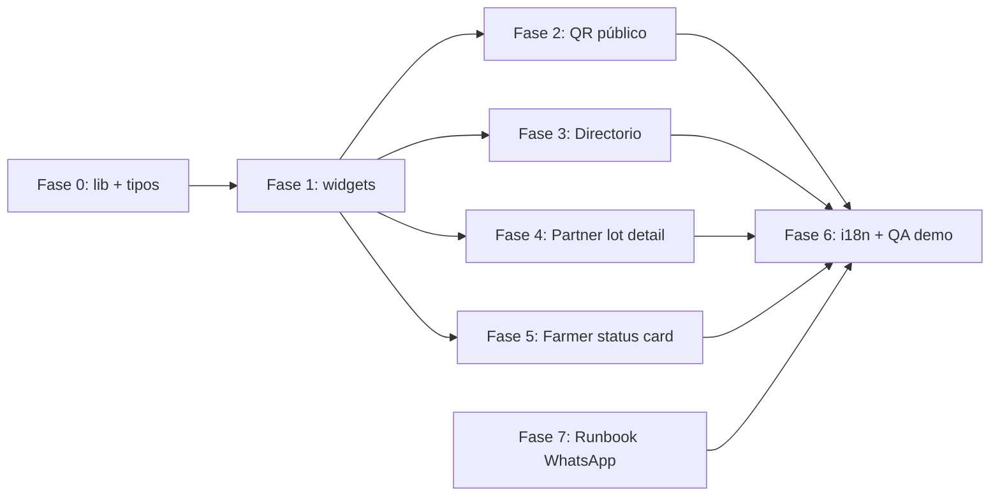

# Diseño: Frontend Copernicus (Jesús + DIGEX)

**Estado:** Fase 1 implementada y validada — ver [frontend-phase1-validation.md](./frontend-phase1-validation.md)  
**Fecha:** 2025-06-01 · **Última actualización:** acuerdos Javier + WhatsApp demo  
**Alcance:** UI que hace visible, escaneable y convincente la prueba Copernicus (sin implementar AI SDK en frontend; solo handoff WhatsApp).

---

## 1. Objetivo

Implementar la capa de presentación del hackathon **Harvverse Sentinel** para que jueces, partners y agricultores vean en primer plano:

- Evidencia satelital (polígono, NDVI, SAR, clima, DEM)
- Score de riesgo 0–100 y desglose de 7 variables
- Estado EUDR y elegibilidad de co-inversión
- Hash de evidencia y prueba on-chain (Hardhat local en demo; Base L2 fuera de alcance inmediato según handoff de Javier)

**Regla de producto:** la historia visible debe ser *prueba Copernicus primero*, no perfil genérico de finca.

**Referencia de contrato de datos:** [`.docs/sentinel/sample-copernicus-snapshot.json`](./sample-copernicus-snapshot.json) y procedimientos tRPC existentes (`lots.publicByCode`, `lots.copernicusSnapshot`, columnas denormalizadas en `lots`).

---

## 2. Estado actual (inventario)

| Entregable | Ruta / superficie | Estado | Notas |
|------------|-------------------|--------|-------|
| Página QR pública | `apps/web/src/app/(app)/lot/[code]/page.tsx` | **~80%** | UI rica: mapa, métricas, 7 variables, YieldPredict, hash, chain. **Problema:** vive bajo layout `(app)` con `AppShell` (sidebar, Clerk) → no es ideal para QR sin login. Falta componente QR descargable/print. Falta gráfica NDVI histórica (solo valor actual). |
| Directorio Open Farms | `(public)/farms`, `(public)/farms/[farmId]` | **~40%** | Listado y detalle existen; **sin** badges de score/EUDR. `FarmCard` solo muestra verificación de finca. |
| Tarjetas de lote (partner) | `LotCard` + `explore` + `lots/[lotId]` | **~35%** | `LotCard` sin Copernicus. Detalle de lote tiene bloque Copernicus básico duplicado, no widgets modulares. |
| Dashboard partner | `dashboard/player` | **~15%** | Métricas de partnerships/inversión, **no** widgets Copernicus. |
| Tarjeta agricultor (elegibilidad) | `dashboard/farmer/lots/[lotId]` | **~55%** | Bloque Copernicus inline; falta tarjeta de estado unificada (elegible / bloqueado / pendiente revisión). |
| Tipos / parsing snapshot | Inline en `lot/[code]/page.tsx` | **Deuda** | `asSnapshot` local ~150 líneas; conviene librería compartida. |
| Sentinel Agent + WhatsApp worker (Sheyla) | `/api/sentinel/alerts` | **Listo (contrato)** | No es UI; documentamos handoff para DIGEX. |
| API directorio | `farms.listPublic` | **Parcial** | Devuelve `lots` anidados; columnas `riskScore`, `eudrStatus` existen en tabla `lots` si Javier/seed las pobló. |
| API listado lotes | `lots.list` | **OK** | Incluye filas completas de `lots` (incl. score denormalizado). |

**Conclusión:** no partimos de cero; el trabajo es **completar gaps**, **extraer componentes reutilizables**, **mover la ruta QR a público** y **alinear directorio + dashboards** con el mismo modelo visual.

---

## 2.1 Decisiones acordadas (Javier + equipo)

### Demo y datos

| Tema | Acuerdo |
|------|---------|
| **Lote QR / pitch** | `HV-HN-ZAF-L02` (Finca Zafiro). Ignorar fixtures viejos (`testlot`, etc.). |
| **Seed** | `pnpm db:seed` crea finca + lote `available`; **no** garantiza snapshot Copernicus. Snapshot vía `lots.computeCopernicusSnapshot` o creación de lote con polígono en UI. |
| **setup:demo** | Registra on-chain y score desde sample JSON; BD `chain.metadataStatus: written` solo tras `lots.markLocalCopernicusProof` (UI o script). UI puede mostrar **pending** hasta entonces. |
| **scoreVersion** | Fixture: `sentinel-v0.3.0` · Live: `sentinel-live-v0.4.0`. `.docs/sentinel/sample-copernicus-snapshot.json` ya está alineado. |
| **variables[].key** | Congeladas durante el hackathon; Javier avisa antes de renombrar. |
| **Payload** | Widgets usan **`copernicusSnapshot` JSONB completo**; campos live avanzados opcionales con fallbacks. |
| **eligibleForInvestment** | Desde snapshot: fixture `EUDR verified && riskScore >= 60`; live `eudrGate.eligibleForMarketplace && riskScore >= 60`. EUDR `non_compliant` bloquea. |

### API pública QR (`lots.publicByCode`) — **Hecho (Javier)**

Implementado en `packages/api/src/routers/lots.ts`:

- `publicProofLotStatuses`: `available`, `reserved`, `active`, `settled`
- Helper `isPublicProofLotStatus()` usado en `publicByCode` y `copernicusSnapshot`
- **Marketplace** sigue restringido a `available`: `lots.list` (default `status: available`), `lots.byCode` (solo `available`)

El QR `/lot/[code]` no se rompe si el lote pasa a reservado, activo o liquidado; `draft` / `coming_soon` / etc. siguen devolviendo 404.

**Frontend:** consumir `lots.publicByCode` sin lógica extra de status.

### On-chain (demo)

- Solo **Hardhat `31337`**; sin explorer externo. UI: “Hardhat local · 31337” + hash corto copiable.
- Base Sepolia fuera del MVP demo.
- `markLocalCopernicusProof` manual (usuario/admin) tras `computeCopernicusSnapshot` y Hardhat listo.

### Directorio

- `farms.listPublic` / `byIdPublic`: lotes anidados traen columnas de score en tabla `lots` vía Drizzle.
- Mantener solo lotes demo limpios en `available` para listado; el QR no depende de eso tras el cambio de `publicByCode`.

### WhatsApp (demo)

| Campo | Valor |
|-------|--------|
| **Número provisional** | `NEXT_PUBLIC_DEMO_WHATSAPP_NUMBER` opcional (E.164); si no existe, el CTA se oculta. |
| **WhatsApp worker / AI SDK** | Sheyla consume endpoints Sentinel Agent y conecta proveedor WhatsApp; no bloquea UI. |
| **Webhook** | `POST /api/sentinel/alerts` (contrato en repo) |

---

## 3. Principios de implementación

1. **Un solo modelo de vista** — `CopernicusSnapshotView` parseado desde fila `copernicus_snapshots` o JSON fixture; misma forma en QR, partner y farmer.
2. **Componentes por widget** — cada entregable del brief = componente en `apps/web/src/components/copernicus/`.
3. **i18n** — claves en `apps/web/messages/es.json` y `en.json` (namespace `copernicus` + extensión de `lot_proof` donde aplique).
4. **Sin duplicar lógica de negocio** — elegibilidad (`eligibleForInvestment`, EUDR, score &lt; 40) viene del API; UI solo explica.
5. **Modo fixture vs live** — badge `sourceMode` visible; no ocultar limitaciones (`dataQuality.warnings`, `parcelScale`).
6. **3D map** — **fuera de alcance** en esta iteración (opcional del brief; solo si sobra tiempo y hay overlay NDVI+DEM).

---

## 4. Arquitectura de componentes (propuesta)

```
apps/web/src/
├── lib/
│   ├── copernicus-snapshot.ts    # parseSnapshot(), tipos, helpers scoreTone/eudrLabel
│   └── chainProof.ts             # (existente) getSnapshotChain, chainLabel
├── components/copernicus/
│   ├── copernicus-badges.tsx           # RiskScoreBadge, EudrBadge, EligibilityBadge
│   ├── copernicus-ndvi-card.tsx        # NDVI actual + sparkline/trend 24m
│   ├── copernicus-yield-predict-card.tsx
│   ├── copernicus-risk-score-card.tsx  # score + 7 variables
│   ├── copernicus-eudr-card.tsx
│   ├── copernicus-proof-card.tsx       # hash + chain + tx link
│   ├── copernicus-farmer-status-card.tsx
│   ├── copernicus-signals-grid.tsx     # métricas S2/S1/ERA5/DEM (reutilizar en QR)
│   └── copernicus-qr-panel.tsx         # QR + URL copiable
└── app/
    ├── (public)/lot/[code]/page.tsx    # NUEVA ruta pública (migrar desde (app))
    └── ... páginas que consumen widgets
```

**Dependencia opcional:** `qrcode.react` o generación SVG ligera para QR (evaluar en implementación; preferir dependencia pequeña ya usada en el monorepo si existe).

---

## 5. Plan por entregable

### 5.1 Página pública QR — `/lot/[code]`

| Ítem | Acción |
|------|--------|
| **Mover ruta** | De `(app)/lot/[code]` → `(public)/lot/[code]` con layout público (navbar landing, sin sidebar). Mantener redirect 308 desde ruta antigua si hace falta. |
| **Refactor** | Extraer contenido a composición de widgets; página &lt; 150 líneas. |
| **QR** | Panel sticky o footer: código QR → URL canónica `https://<host>/lot/<code>`, botón copiar enlace, hint “escanea para ver prueba satelital”. |
| **NDVI trend** | Gráfica de línea con `sentinel2.historicalSeries` (últimos 12–24 meses); fallback texto si serie vacía. Reutilizar `packages/ui` chart si ya está en el proyecto. |
| **Print / demo** | Clase CSS `@media print` opcional: ocultar nav, mostrar score + hash + QR (útil para jueces). |
| **Datos** | `trpc.lots.publicByCode({ code })` — Javier amplía statuses públicos (ver §2.1). |
| **Estados vacíos** | Sin snapshot: CTA “score pendiente” (no inventar números). |

**Criterio de aceptación:** un juez escanea QR en móvil sin cuenta Clerk y ve polígono, score, EUDR, 7 variables, YieldPredict, hash y estado de prueba local.

---

### 5.2 Open Farms Directory — badges score y EUDR

| Superficie | Acción |
|------------|--------|
| **`FarmCard`** | Mostrar agregado de lotes de la finca: mejor `riskScore` (max), peor `eudrStatus` (prioridad: `non_compliant` &gt; `unknown` &gt; `verified`), chip “Co-inversión disponible” si algún lote `eligibleForInvestment`. |
| **`/farms/[farmId]`** | Sección “Lotes verificados por Copernicus”: lista de lotes con `LotCopernicusSummaryRow` (código, score, EUDR, enlace a `/lot/<code>`). |
| **`LotCard` (variant partner)** | Badges score + EUDR en imagen del card; enlace secundario “Ver prueba” → `/lot/<code>`. |
| **Landing preview** | `open-farms-preview.tsx`: alinear con mismos badges si muestra fincas. |

**API:** preferir **sin cambio** inicial — calcular agregados en cliente desde `farm.lots[]` usando columnas denormalizadas en `lots`. Si el payload público no trae `riskScore`/`eudrStatus` en lotes anidados, **cambio mínimo en API** (ver §7): incluir esos campos en el `with: { lots: ... }` de `farms.listPublic` / `byIdPublic`.

**Criterio de aceptación:** en el directorio se distingue visualmente una finca con score 85/EUDR Verified vs una sin score o bloqueada.

---

### 5.3 Dashboard partner — widgets Copernicus

**Ubicaciones propuestas:**

1. **`/lots/[lotId]`** (detalle antes de invertir) — grid 2×2 de widgets debajo del hero del lote.
2. **`/dashboard/player/explore`** — opcional: mini-badge en cards (ya cubierto por `LotCard`).
3. **`/investments/[id]`** — panel compacto “Score al momento de la inversión” si el partnership tiene `lotId` (solo si hay snapshot en BD).

| Widget | Contenido |
|--------|-----------|
| **NDVI card** | `currentNdvi`, `twoYearAverageNdvi`, tendencia (↑/↓ vs media), mini chart `historicalSeries`. |
| **YieldPredict card** | `projectedQuintales`, banda baja-alta, texto `investmentArgument` traducido. |
| **Risk Score card** | Score grande, tier, barras de 7 variables (mismo diseño que QR). |
| **EUDR card** | Badge + razones (`eudr.reasons`), gate absoluto si `non_compliant`. |
| **Proof card** | `scoreHash` completo (copiar), `chain.metadataStatus`, `transactionHash` con enlace explorador Hardhat/Base según `chainId`. |

**Datos:** `trpc.lots.byId` (o procedimiento existente que ya adjunta `copernicusSnapshot`) — verificar que partners autenticados reciben snapshot completo JSONB.

**Criterio de aceptación:** un partner entiende en &lt; 30 s por qué el lote es invertible o bloqueado, con evidencia satelital explícita.

---

### 5.4 Tarjeta agricultor — elegibilidad del lote

**Ubicación:** `dashboard/farmer/lots/[lotId]` — columna lateral superior, componente `CopernicusFarmerStatusCard`.

| Estado UI | Condición |
|-----------|-----------|
| **Elegible para co-inversión** | `eligibleForInvestment === true` |
| **Bloqueado** | `eudrStatus === 'non_compliant'` OR `riskScore < 40` |
| **Pendiente / revisión** | sin snapshot, o `eudr.requiresManualReview`, o score 40–59, o EUDR `unknown` |
| **Acciones** | Botón “Ver página pública” → `/lot/<code>`; si sin snapshot, CTA “Calcular score” (llama `computeCopernicusSnapshot` — ya existe en API, solo exponer en UI si no está). |

**Criterio de aceptación:** el agricultor ve un solo mensaje claro de estado sin leer el desglose técnico completo.

---

### 5.5 DIGEX / Experenta — WhatsApp y handoff AI SDK

**Alcance de Jesús/DIGEX en este sprint:** documentación operativa + prueba del webhook, no implementar Meta Cloud API en el repo (responsabilidad de infra DIGEX + flujos Sheyla).

| Entregable doc | Contenido |
|----------------|-----------|
| **Runbook WhatsApp** | Número demo, plantillas ES farmer/partner (tomar de `start-handoff.md`), opt-in, límites Meta. |
| **Contrato alertas** | `GET /api/sentinel/agent/context`, `GET /api/sentinel/agent/knowledge`, `POST /api/sentinel/agent/scenarios` y `POST /api/sentinel/alerts`. |
| **Checklist integración** | URL pública (ngrok/Cloudflare tunnel en dev), secret header si se añade, prueba con `curl` desde doc. |
| **Enlaces UI → WhatsApp** | Opcional post-MVP: en página QR “Recibir alertas” → wa.me con texto prellenado (solo si DIGEX entrega número). |

**Qué necesitamos de DIGEX/Experenta:** ver §8.

---

## 6. Fases de trabajo (orden sugerido)



| Fase | Duración estimada | Entregable |
|------|-------------------|------------|
| 0 | 0.5 d | `copernicus-snapshot.ts`, tests manuales con fixture JSON |
| 1 | 1 d | 6–8 componentes en `components/copernicus/` |
| 2 | 0.5–1 d | Ruta pública + QR + migración |
| 3 | 0.5 d | `FarmCard`, detalle finca, `LotCard` |
| 4 | 0.5 d | Grid widgets en `lots/[lotId]` |
| 5 | 0.25 d | `CopernicusFarmerStatusCard` |
| 6 | 0.5 d | i18n, responsive, datos demo seed |
| 7 | paralelo | `whatsapp-demo-runbook.md` (DIGEX) |

**Total estimado:** ~3–4 días de desarrollo frontend con datos fixture/seed; menos si validamos alcance reducido (p. ej. omitir panel en `investments/[id]`).

---

## 7. Cambios fuera de `apps/web` (coordinación con Javier)

| Cambio | ¿Necesario? | Responsable | Descripción |
|--------|-------------|-------------|-------------|
| `lots.publicByCode` — statuses públicos ampliados | **Hecho** | Javier | `available` \| `reserved` \| `active` \| `settled`; ver §2.1. |
| `farms.listPublic` — columnas score en lotes | **No (si Drizzle ya las trae)** | — | Usar `farm.lots[].riskScore`, `eudrStatus`, etc. |
| Actualizar `sample-copernicus-snapshot.json` | **Hecho** | Javier | Alineado con fixture `sentinel-v0.3.0` y live `sentinel-live-v0.4.0`. |
| Mover `lot/[code]` a `(public)` + Clerk | **Sí** | Jesús | Ruta QR sin `AppShell`. |
| Explorador de tx | **No** | — | Solo hash corto + label Hardhat 31337. |

**No planeamos** cambios al motor de scoring ni contratos en esta iniciativa frontend.

---

## 8. Pendiente de Jesús (antes / durante implementación)

### 8.1 Producto (sin respuesta aún)

- [ ] **URL de demo** (localhost, Vercel, túnel).
- [ ] **Idioma QR:** ¿solo ES o ES + EN?
- [ ] **Partner home** (`dashboard/player`): ¿widgets Copernicus o solo `lots/[lotId]`?
- [ ] **`investments/[id]`:** ¿panel Copernicus en MVP?

### 8.2 WhatsApp / AI SDK

- [x] **Número demo opcional:** `NEXT_PUBLIC_DEMO_WHATSAPP_NUMBER` (sujeto a cambio; si no existe, se oculta el CTA).
- [ ] **AI SDK/worker:** Sheyla conecta los endpoints Sentinel Agent y el proveedor WhatsApp.
- [ ] **Webhook secret** (opcional): definir si `SENTINEL_WEBHOOK_SECRET` en prod.

### 8.3 Javier — resuelto (ver §2.1)

- [x] Lote demo, scoreVersion, keys, snapshot, elegibilidad, `publicByCode`, chain local.

### 8.4 Diseño / marca

- [ ] ¿Logo/wordmark en página QR pública o minimalista sin chrome?
- [ ] ¿Paleta fija para badges EUDR (verde/rojo/ámbar) — asumimos la actual del repo salvo indicación.

### 8.5 Acceso técnico

- [ ] `apps/web/.env` con Clerk de test (ya documentado en README).
- [ ] Opcional: credenciales Sentinel Hub si quieres probar UI con `sourceMode: live` (no bloqueante para UI).

---

## 9. Archivos que tocaremos (checklist)

### Crear

- `.docs/sentinel/whatsapp-demo-runbook.md` (Fase 7)
- `apps/web/src/lib/copernicus-snapshot.ts`
- `apps/web/src/components/copernicus/*.tsx` (8 archivos aprox.)
- `apps/web/src/app/(public)/lot/[code]/page.tsx`

### Modificar

- `apps/web/src/components/farm-card.tsx`
- `apps/web/src/components/lot-card.tsx`
- `apps/web/src/app/(public)/farms/[farmId]/page.tsx`
- `apps/web/src/app/(app)/lots/[lotId]/page.tsx` (sustituir bloque inline por widgets)
- `apps/web/src/app/(app)/dashboard/farmer/lots/[lotId]/page.tsx`
- `apps/web/messages/es.json`, `en.json`
- Opcional: `packages/api/src/routers/farms.ts` (select explícito en lotes públicos)
- Eliminar o redirigir: `apps/web/src/app/(app)/lot/[code]/page.tsx`

### No tocar (salvo bug)

- `packages/api/src/lib/copernicus.ts` (motor de score)
- Contratos Solidity
- WhatsApp worker / AI SDK (rama de Sheyla)

---

## 10. Riesgos y mitigaciones

| Riesgo | Mitigación |
|--------|------------|
| QR detrás de login por layout `(app)` | Migrar a `(public)`; verificar Clerk middleware. |
| QR 404 tras inversión (status) | Resuelto en API (`publicProofLotStatuses`). |
| Lotes sin snapshot en BD | UI “pendiente”; demo: `computeCopernicusSnapshot` en `HV-HN-ZAF-L02`. |
| JSONB inconsistente entre fixture y live | Parser tolerante + tests con `sample-copernicus-snapshot.json`. |
| Duplicación de UI | Fase 0–1 obligatoria antes de más páginas. |
| Scope creep (3D, Base mainnet) | Explícitamente fuera; solo enlaces a tx si existen. |

---

## 11. Definición de “hecho” (hackathon)

- [x] `/lot/<code>` accesible sin autenticación, con QR imprimible.
- [x] Directorio `/farms` muestra score y EUDR a nivel finca/lote.
- [x] Detalle partner en `/lots/[id]` muestra los 5 widgets Copernicus.
- [x] Agricultor ve tarjeta de estado elegible/bloqueado/pendiente.
- [x] Copy y labels bilingües ES/EN (`lot_proof` + `copernicus`).
- [ ] Runbook WhatsApp entregado a DIGEX con ejemplo `curl` al webhook. → **Fase 2**
- [ ] Demo ensayada con un código de lote y hash visible. → **Fase 2**

---

## 12. Próximo paso

1. ~~Validar acuerdos con Javier~~ — hecho (§2.1).  
2. ~~Merge `publicByCode`~~ — hecho.  
3. **Implementación** Fase 0–1: `copernicus-snapshot.ts` + componentes + QR en `(public)`.

### Checklist demo (día del pitch)

```bash
pnpm db:start && pnpm db:push
pnpm db:seed   # o setup:demo según flujo acordado
# En UI o API: computeCopernicusSnapshot para HV-HN-ZAF-L02
# Opcional: markLocalCopernicusProof → "Local proof verified"
# Abrir: /lot/HV-HN-ZAF-L02 (público, sin login)
```

---

## Apéndice A — Mapeo entregable brief → componente

| Brief | Componente / ruta |
|-------|-------------------|
| Public QR lot page | `(public)/lot/[code]` + `CopernicusQrPanel` |
| Directory score/EUDR badges | `CopernicusBadges` en `FarmCard`, `LotCard` |
| NDVI current/trend | `CopernicusNdviCard` |
| YieldPredict | `CopernicusYieldPredictCard` |
| Risk Score 7 variables | `CopernicusRiskScoreCard` |
| EUDR eligibility | `CopernicusEudrCard` |
| Evidence hash + chain | `CopernicusProofCard` |
| Farmer status | `CopernicusFarmerStatusCard` |
| WhatsApp setup | `whatsapp-demo-runbook.md` + coordinación DIGEX |

## Apéndice B — Procedimientos tRPC de referencia

| Procedimiento | Uso UI |
|---------------|--------|
| `lots.publicByCode({ code })` | Página QR |
| `lots.copernicusSnapshot({ lotId })` | Alternativa si solo hay id |
| `lots.byId` / detalle con `copernicusSnapshot` | Partner + farmer |
| `farms.listPublic` | Directorio |
| `farms.byIdPublic({ farmId })` | Detalle finca |
| `lots.computeCopernicusSnapshot` | CTA agricultor (opcional) |

---

*Documento preparado para revisión del equipo Harvverse Sentinel (hackathon Copernicus).*
